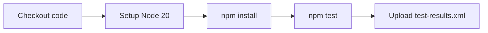

# Solar System CI Workflow — Teaching Guide

This document explains the **Install Dependencies** and **Unit Testing** steps in `.github/workflows/solar-system.yml`, so you can teach students **why** and **how** we use them in GitHub Actions.

---

## Workflow Overview

The workflow runs on:

- Every **push** to `main` or `feature/*` branches
- **Manual trigger** via `workflow_dispatch`

```yaml
name: Solar System Workflow

on:
  workflow_dispatch:
  push:
    branches:
      - main
      - 'feature/*'
```

The job runs on a fresh **Ubuntu** virtual machine (`ubuntu-latest`) provided by GitHub Actions.

---

## Full Pipeline (Steps in Order)

By the time we reach **Install Dependencies** and **Unit Testing**, GitHub Actions has already:

1. **Checked out** your code onto a fresh Ubuntu VM
2. **Installed Node.js 20** on that machine

Then these two steps run:

```yaml
- name: Install Dependencies
  run: npm install

- name: Unit Testing
  run: npm test
```

After tests pass, results are archived:

```yaml
- name: Archive Test Result
  uses: actions/upload-artifact@v3
  with:
    name: Mocha-Test-Result
    path: test-results.xml
```

### Pipeline flow



---

## Step 1: Install Dependencies (`npm install`)

### What it does

```yaml
- name: Install Dependencies
  run: npm install
```

This command reads `package.json` (and `package-lock.json` if present) and downloads all libraries the app needs into a `node_modules/` folder on the CI runner.

In this project, that includes:

| Type | Packages | Purpose |
|------|----------|---------|
| **Runtime (`dependencies`)** | `express`, `mongoose`, `cors`, etc. | Powers the Solar System API |
| **Test tools (`devDependencies`)** | `mocha`, `chai`, `chai-http` | Runs and asserts the tests |
| **Reporting** | `mocha-junit-reporter` | Writes `test-results.xml` for CI |

### Why we need it in CI

- The GitHub runner starts **empty** — it has Node.js, but not your project libraries.
- `node_modules/` is **not committed** to Git (and should not be).
- Every CI run must install dependencies from scratch, the same way a new developer would on a fresh laptop:

```bash
git clone ...
cd solar-system
npm install   # ← same command, local or CI
```

### What to tell students

> **"Install Dependencies" = prepare the environment.**  
> CI cannot run or test your app until all required packages are downloaded.  
> This step makes the runner behave like a developer machine after `npm install`.

### What success/failure looks like

- **Pass:** All packages install; step goes green.
- **Fail:** Missing package, network issue, or version conflict → pipeline stops here; tests never run.

---

## Step 2: Unit Testing (`npm test`)

### What it does

```yaml
- name: Unit Testing
  run: npm test
```

This does **not** run a magic GitHub command. It runs whatever is defined in `package.json`:

```json
"scripts": {
  "start": "node app.js",
  "test": "mocha app-test.js --timeout 10000 --reporter mocha-junit-reporter --exit",
  "coverage": "nyc --reporter cobertura --reporter lcov --reporter text --reporter json-summary  mocha app-test.js --timeout 10000  --exit"
}
```

Breaking that down:

| Flag / piece | Meaning |
|--------------|---------|
| `mocha app-test.js` | Run tests in `app-test.js` with the Mocha test runner |
| `--timeout 10000` | Each test gets up to 10 seconds (API/DB calls can be slow) |
| `--reporter mocha-junit-reporter` | Output JUnit XML → `test-results.xml` (used by the next step) |
| `--exit` | Force Mocha to exit when done (important in CI) |

### What is actually being tested

`app-test.js` uses **Chai** for assertions and **chai-http** to send HTTP requests to your Express app (`app.js`):

- **Planet API:** POST `/planet` with `{ id: 1 }` … `{ id: 8 }` and check names (Mercury … Neptune)
- **Other endpoints:** GET `/os`, `/live`, `/ready` and check status codes and JSON

Example test:

```javascript
it('it should fetch a planet named Mercury', (done) => {
    let payload = { id: 1 }
    chai.request(server)
        .post('/planet')
        .send(payload)
        .end((err, res) => {
            res.should.have.status(200);
            res.body.should.have.property('id').eql(1);
            res.body.should.have.property('name').eql('Mercury');
            done();
        });
});
```

These are often called **integration/API tests** (they hit real HTTP routes), but in CI we still label the job "Unit Testing" — the idea is the same: **automated checks that code behaves as expected**.

### Why we run tests in CI

1. **Catch bugs early** — Broken code on `main` or a feature branch fails the workflow before deploy.
2. **Same check everywhere** — Every push gets the same test run; no "works on my machine."
3. **Gate for later steps** — If tests fail, the job fails; you can block merges until green.
4. **Repeatable feedback** — Developers see pass/fail in the Actions tab without running tests locally every time.

### What to tell students

> **"Unit Testing" in CI = run your test script automatically on every change.**  
> `npm test` is the contract: locally and in GitHub Actions you use the **same command**, so CI validates what you would validate by hand.

### What success/failure looks like

- **Pass:** All Mocha tests pass → green step; `test-results.xml` is produced.
- **Fail:** Any assertion fails (wrong status, wrong planet name, etc.) → red step; the whole job is marked failed.

---

## How the Two Steps Connect

- **Install Dependencies** must run **before** tests — Mocha/Chai are not on the runner until `npm install` finishes.
- **Unit Testing** depends on installed packages **and** your source code (`app.js`, `app-test.js`).

---

## Simple Analogy for the Classroom

| Step | Real life |
|------|-----------|
| Checkout + Setup Node | Rent a computer and install Node |
| **Install Dependencies** | `npm install` — get all libraries from the recipe (`package.json`) |
| **Unit Testing** | `npm test` — run the exam (`app-test.js`) and pass/fail automatically |

---

## Archive Test Result (Bonus Step)

After tests, **Archive Test Result** uploads `test-results.xml`:

```yaml
- name: Archive Test Result
  uses: actions/upload-artifact@v3
  with:
    name: Mocha-Test-Result
    path: test-results.xml
```

That file exists because of `--reporter mocha-junit-reporter` in the test script. Students can download it from the Actions run to see structured results — useful when teaching **test reports in CI**.

---

## One-Liners for Students

- **Install Dependencies:** "We download everything the app needs because the CI server starts with nothing in `node_modules`."
- **Unit Testing:** "We run the same `npm test` as on your laptop, so every push proves the API still works before we trust the code."

---

## Try It Locally (Demo Script)

Run the same commands on your machine that CI runs:

```bash
# 1. Install dependencies (same as CI)
npm install

# 2. Run tests (same as CI)
npm test

# 3. Optional: check that the report file was created
ls -la test-results.xml
```

If both commands succeed locally, the CI steps should behave the same way on GitHub Actions.
